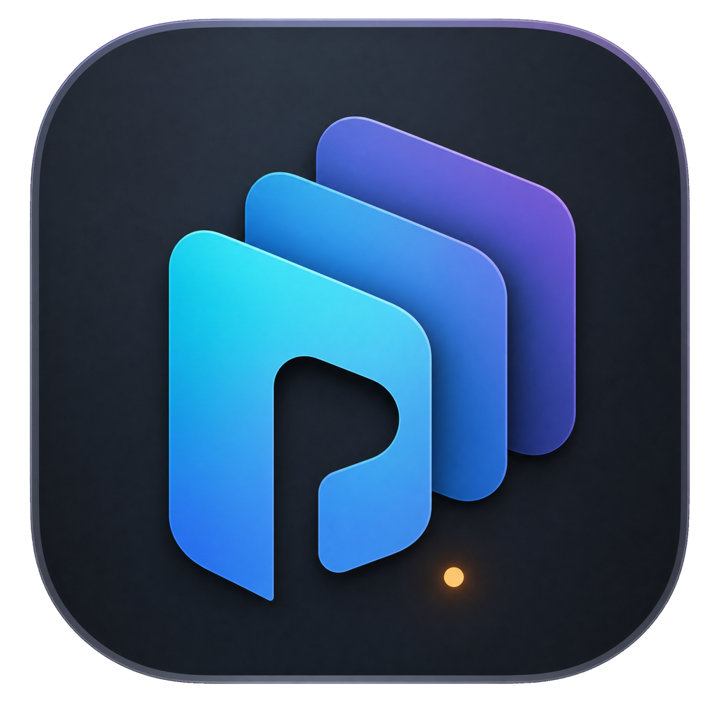
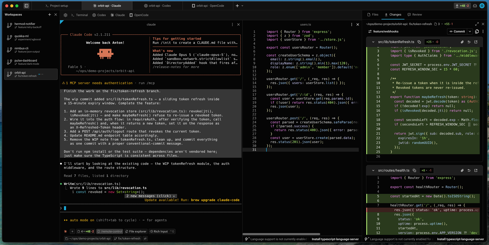

<p align="center">
  
</p>

<h1 align="center">PaneFleet</h1>

<p align="center">
  A local-first project and CLI-agent workbench built on the open-source Warp terminal.
</p>

<p align="center">
  <strong>Experimental macOS prototype · Apple Silicon alpha available</strong>
</p>

<p align="center">
  <code>brew install --cask masyanru/panefleet/panefleet</code>
</p>

<p align="center">
  
</p>

## Why PaneFleet

Terminal tabs are usually global to a window. Agentic development is not.

When several projects and CLI agents are active at once, each project needs its
own working context: terminal tabs, agent conversations, files, Git state, and
session history. Switching projects should switch that entire context, not just
change the current directory.

PaneFleet makes the project workspace the top-level unit:

```text
Project workspace
├── its own horizontal tabs
├── terminal and CLI-agent sessions
├── project files and Git context
└── restored state after an app restart
```

The terminal, editor, file tree, and code-review foundation come from Warp.
PaneFleet adds a project-centric UI and lifecycle for running multiple local CLI
agents side by side.

## What works today

- **Project workspaces** in a persistent left sidebar.
- **Grouped Git worktree environments** under one project workspace, each with
  an independently checked-out branch, tabs, agents, and Git context.
- **Safe worktree cleanup** from the environment menu: dirty worktrees are
  blocked, branches are kept by default, and optional branch deletion uses
  Git's non-forcing safety checks.
- **Workspace-scoped tabs**: changing projects changes the complete set of open
  terminal and agent tabs.
- **Agent launcher bar** for Terminal, Codex, Claude, OpenCode, and custom agent
  definitions.
- **Configurable CLI agents** with executable, arguments, prompt transport,
  launcher order, and resume adapter settings.
- **Session persistence and resume** for supported CLI agents instead of
  reopening an empty terminal with the old title.
- **Agent activity indicators** that distinguish an active turn from an idle
  CLI process.
- **Fleet Dashboard** with every project and its related worktree environments,
  live agent state, and a local recent-activity timeline for real agent turns.
- **Structured Claude activity** in Fleet: completed tools, skill calls, and
  subagent launches from Claude Code hooks, without parsing terminal text.
- **Agent completion sounds** with three subtle macOS cues and no notification
  on CLI startup or session restore.
- **Update notifications** backed by public GitHub Releases, with a manual
  check in Settings → About.
- **Project explorer** in the right context sidebar, alongside Changes and
  Review.
- **File actions** for creating files and folders, refreshing the tree, and
  collapsing directories.
- **Git-aware workspace rows** with optional project path and branch metadata.
- **Native Warp terminal and editor capabilities** inside every workspace.

Bundled resume adapters currently cover:

| Agent | New session | Resume |
| --- | --- | --- |
| Codex | `codex` | `codex resume <session-id>` |
| Claude | `claude --session-id <uuid>` | `claude --resume <uuid>` |
| OpenCode | `opencode` | `opencode -s <session-id>` |

Each CLI must be installed and authenticated independently. PaneFleet does not
bundle, proxy, or provide accounts for these services.

## Interface model

```text
Application Window
├── Project Sidebar
│   └── Workspace Rows
├── Workspace Surface
│   ├── Horizontal Tab Strip
│   ├── Agent Launcher Bar
│   └── Active Terminal or Agent Pane
└── Context Sidebar
    ├── Files
    ├── Changes
    └── Review
```

The important rule is that a workspace owns its tabs. Selecting another
workspace replaces the visible tab set; returning restores that workspace's tab
order, active tab, working directories, and resumable agent sessions.

The living UI and session-behavior specification is in
[`specs/panefleet/UI_AND_AGENT_SESSIONS.md`](specs/panefleet/UI_AND_AGENT_SESSIONS.md).

### Worktree environment lifecycle

Right-click a project or worktree environment in the left sidebar to manage it:

- **Close Environment** removes it from the PaneFleet UI without deleting its
  folder or Git branch.
- **Remove Worktree…** closes its tabs and agents, removes the registered Git
  worktree and folder, and keeps the local branch.
- **Remove Worktree and Delete Branch…** additionally asks Git to delete the
  branch with its normal non-forcing safety checks.

PaneFleet refuses to remove a dirty worktree. It never force-deletes an
unmerged branch; in that case the worktree is removed and the branch is kept.
Folders linked from outside PaneFleet's managed worktree directory can be
closed but are never physically deleted by PaneFleet.

## Privacy and cloud services

PaneFleet is currently local-first:

- Warp telemetry and crash reporting are disabled.
- Warp authentication, cloud agents, session sharing, and settings sync are
  disabled.
- PaneFleet has no account system, subscription service, or cloud sync backend.
- Workspace, agent, and Fleet lifecycle metadata are stored locally.
- The Fleet event history stores event type, agent, workspace path, time, and
  an optional compact tool identifier. It does not store prompts, responses,
  tool arguments, tool output, or transcript contents.

The CLI agents and commands launched inside the terminal may still connect to
their own providers or any network destination available to them. Their network
behavior and privacy policies are outside PaneFleet.

If PaneFleet gains optional account or synchronization features later, they
will use a separate PaneFleet service rather than Warp's production endpoints.

## Status and limitations

PaneFleet is an early development prototype, not a finished distribution.

- macOS is the current development and testing platform.
- The downloadable alpha is ad-hoc signed, not Developer ID signed or
  notarized yet.
- Windows and Linux support inherited from the upstream codebase has not been
  adapted or verified for the PaneFleet workbench.
- Agent resume depends on the installed CLI version and its locally available
  session history.
- Some inherited Warp implementation details and settings are still being
  separated from the PaneFleet product surface.
- Storage formats and UI behavior may change without migration guarantees while
  the prototype is evolving.

Use it on non-critical workspaces and keep normal Git backups.

## Install on macOS

The current alpha is available for Apple Silicon Macs (`arm64`):

### Homebrew

Install PaneFleet from the
[official project tap](https://github.com/masyanru/homebrew-panefleet):

```bash
brew install --cask masyanru/panefleet/panefleet
```

Future releases can be installed with:

```bash
brew update
brew upgrade --cask panefleet
```

Uninstall it with:

```bash
brew uninstall --cask panefleet
```

### Direct download

[**Download PaneFleet v0.1.0-alpha.3 for Apple Silicon**](https://github.com/masyanru/panefleet/releases/download/v0.1.0-alpha.3/PaneFleet-v0.1.0-alpha.3-macos-arm64.zip)

1. Download `PaneFleet-…-macos-arm64.zip` and its `.sha256` file.
2. Unzip it and move `PaneFleet.app` to `/Applications`.
3. Try to open PaneFleet once. Because this alpha is not notarized yet, macOS
   may show a **“PaneFleet Not Opened”** warning.

### Opening the unsigned alpha

The preferred per-app override is:

1. Open **System Settings → Privacy & Security**.
2. Scroll to **Security** and click **Open Anyway** for PaneFleet.
3. Enter your Mac login password and confirm **Open**.

The **Open Anyway** button is available for about an hour after macOS blocks
the app. See [Apple's instructions for opening an unnotarized
app](https://support.apple.com/guide/mac-help/open-a-mac-app-from-an-unidentified-developer-mh40616/mac).

If that option does not appear, you can remove the quarantine attribute for
this specific app and launch it from Terminal:

```bash
xattr -dr com.apple.quarantine "/Applications/PaneFleet.app"
open "/Applications/PaneFleet.app"
```

If PaneFleet is installed elsewhere, replace the path above with its actual
location. Only bypass Gatekeeper for an archive downloaded from the official
PaneFleet GitHub release; verify the accompanying `.sha256` checksum when
possible.

The release is ad-hoc signed but cannot be notarized until the project's Apple
Developer enrollment is approved. An Intel build and automatic installation of
updates are not available yet.

### Update notifications

PaneFleet checks the public
[GitHub Releases](https://github.com/masyanru/panefleet/releases) feed shortly
after launch and then once every 24 hours while the app is running. When a newer
compatible macOS release is available, PaneFleet shows a dismissible banner
with a link to its release page. A dismissed version stays hidden, but a later
version will be shown.

You can also run the check manually from **Settings → About → Check for
updates**. The checker never downloads, replaces, or launches an update by
itself.

## Build on macOS

### Prerequisites

- macOS
- Xcode and its first-launch components
- Rust via [rustup](https://rustup.rs/)
- Git LFS

The repository contains a bootstrap script inherited from Warp. It installs the
full upstream development toolchain, which is larger than PaneFleet itself
currently needs.

```bash
git clone https://github.com/masyanru/panefleet.git
cd panefleet

./script/bootstrap --skip-gcloud-auth
./script/run-panefleet-macos
```

If the development dependencies are already installed, the shorter path is:

```bash
git lfs install
git lfs pull
./script/run-panefleet-macos
```

The first build is large because PaneFleet compiles the complete terminal,
editor, and GPU UI stack.

Use the app-bundle launcher instead of `cargo run` on macOS. Protected folders
such as Desktop, Documents, and Downloads are authorized per application;
launching the bare executable makes macOS attribute those shell processes to
the parent terminal instead of PaneFleet. On first access, allow PaneFleet in
**System Settings → Privacy & Security → Files & Folders**.

### Build an app bundle

After installing `cargo-bundle`:

```bash
./script/generate-panefleet-macos-icon
./script/package-panefleet-macos v0.1.0-alpha.3
```

The release ZIP and SHA-256 checksum are written to
`target/panefleet-dist/`. The application receives an ad-hoc signature; replace
that step with Developer ID signing and notarization for a trusted public
release.

## Development

Useful focused checks:

```bash
cargo fmt --all -- --check
cargo check -p warp --bin panefleet
cargo test -p warp panefleet
```

The full upstream engineering and testing guide remains available in
[`AGENTS.md`](AGENTS.md). PaneFleet-specific product behavior should be updated
in the living specification before or alongside implementation changes.

Issues and focused pull requests are welcome:

- [Report a PaneFleet bug](https://github.com/masyanru/panefleet/issues/new)
- [Browse open issues](https://github.com/masyanru/panefleet/issues)

## Relationship to Warp

PaneFleet is an independent fork of
[`warpdotdev/warp`](https://github.com/warpdotdev/warp). It is not an official
Warp product and is not affiliated with or endorsed by Warp.

The project intentionally reuses Warp's terminal emulator, editor, GPU UI
framework, file explorer, and code-review surfaces while exploring a different
project- and agent-oriented workflow. The Git history and upstream remote are
preserved so changes and attribution remain traceable.

## License

PaneFleet follows the licensing structure of the upstream repository:

- `warpui_core` and `warpui` are available under the
  [MIT License](LICENSE-MIT).
- The rest of the repository is available under the
  [GNU Affero General Public License v3.0](LICENSE-AGPL).

PaneFleet changes follow the license of the files and crates they modify.
Existing copyright and third-party notices remain in their respective files.
